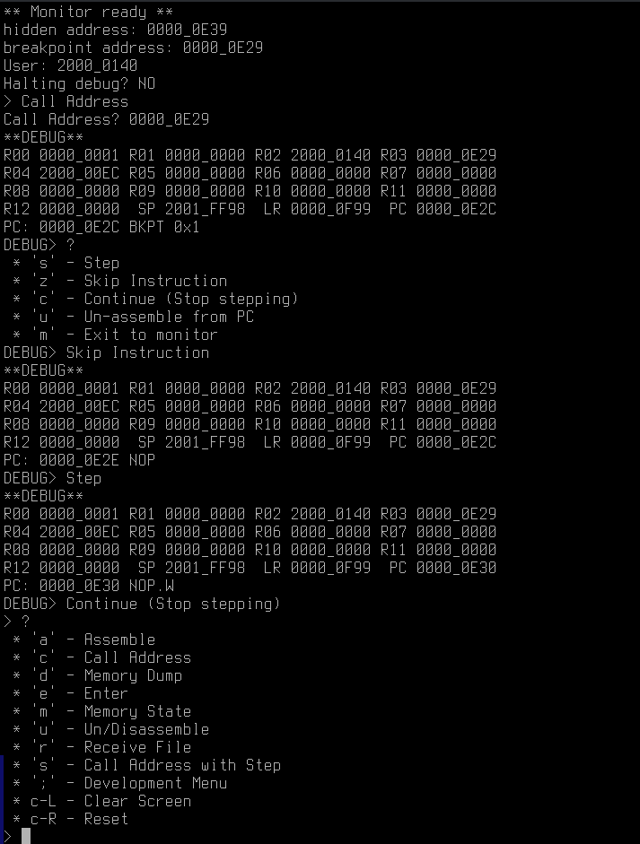

# Monitor



[Video Demo](https://www.youtube.com/watch?v=LVVa_f7M40M)

An on-chip stepping debugger, with support for assembling instructions
and modifying memory interactivity over the UART. Similar to those found
on vintage home computers.

This was initially written to explore using the debug monitor exception
available on some ARM cores.

* Target code is written in C and Thumb assembly
* Unit test code is written in C and C++ with googletest

NOTE: Currently only a subset of the instruction set is supported for
assembling and disassembling.

## Supported targets (so far)
* [NUCLEO-F411RE](https://www.st.com/en/evaluation-tools/nucleo-f411re.html)

## Build Dependencies
* Binutils (--target arm-none-eabi)
* GCC (--target arm-none-eabi)
* CMake
* GoogleTest (optional - testing only)

## Misc Dependencies
* [meta-bfield](https://github.com/tobyWorland/meta-bfield) (1)
* Python3 & matplotlib (optional - generate piechart breakdown of large object files)

(1) Pragmatically generates the C source for encoding and decoding thumb instructions. Written for this project. Output is stored in `monitor/autogen_encodings`

## Quick Build

```
./scripts/quick_build_and_flash.sh
```
1. Check the serial console (115200bps, no parity, one stop bit, no flow control) for the menu.
2. Disconnect your debugger and reset, you will need to cut power.
3. If the serial terminal reports "Halting debug? YES" try step 3 again.

"Halting debug" means the hardware debugger is connected. The hardware debugger will always take priority over the debug monitor exception on debug events.

## Build Everything

```
git submodule update --init
./scripts/build.sh
```

## Help system
Most user input is handled with menus defined in `menu.c`.

You can hit '?' to get a list of actions at any menu.

Keys prefixed with "C-" are keys with control held. So "C-r" means press `ctrl` with `r`.
